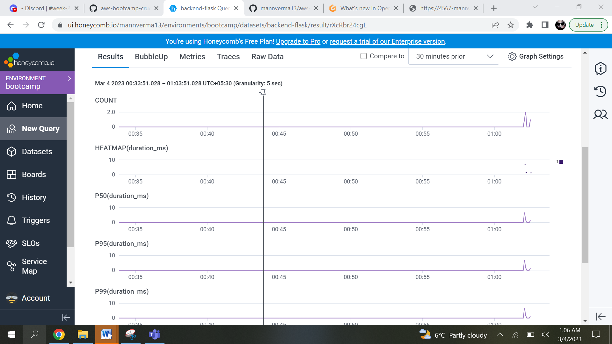
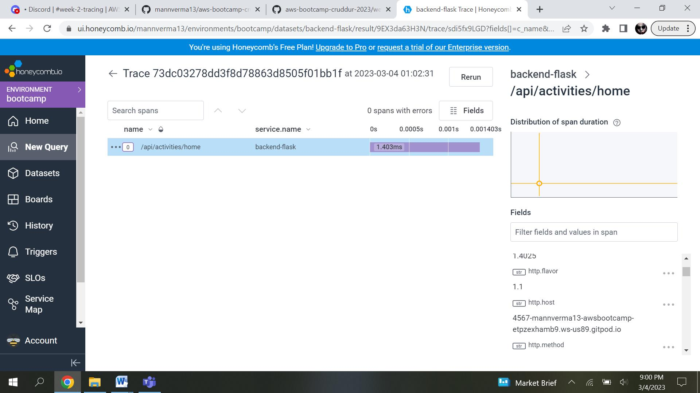
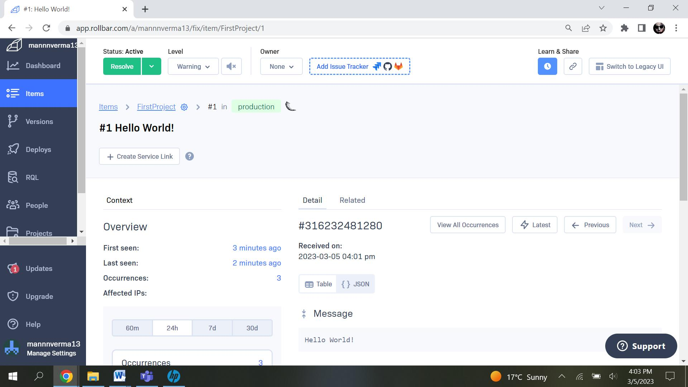

# Week 2 — Distributed Tracing

This week we learnt about distributed tracing. How can we logs different services of our app.
Distributed tracing is a method of tracking application requests as they flow from frontend devices to backend services and databases. Developers can use distributed tracing to troubleshoot requests that exhibit high latency or errors.It helps to visulize errors using graphs, trace id etc.
It logs information for a transaction as it flows through differnet services, conatiners, infrstructure.

This week we use three different services to perfrom distibuted tracing.

##  1. Honeycomb.io
Honeycomb provides tracing and logging functions. It provides hierarchical tracing bu creating unique parent id and child id. It provides event based tracing with each event known as spans.
Honeycomb prvides differnet methods to analyse data using queries, graphical structurem, or by diagram flow.

A span includes below key paramenters which help to analyse data.
 
A serviceName identifying the service the span is from
A name identifying the role of the span (like function or method name)
A timestamp that corresponds to the start of the span
A duration that describes how long that unit of work took to complete
An ID that uniquely identifies the span
A traceID identifying which trace the span belongs to
A parentID representing the parent span that called this span
Any additional metadata that might be helpful.

# add to app.py

```python
# HoneyComb ------
from opentelemetry import trace
from opentelemetry.instrumentation.flask import FlaskInstrumentor
from opentelemetry.instrumentation.requests import RequestsInstrumentor
from opentelemetry.exporter.otlp.proto.http.trace_exporter import OTLPSpanExporter
from opentelemetry.sdk.trace import TracerProvider
from opentelemetry.sdk.trace.export import BatchSpanProcessor
```

```python
# Initialize tracing and an exporter that can send data to Honeycomb
provider = TracerProvider()
processor = BatchSpanProcessor(OTLPSpanExporter())
provider.add_span_processor(processor)
trace.set_tracer_provider(provider)
tracer = trace.get_tracer(__name__)
```

```python
# Honeycmb---
# Initialize automatic instrumentation with Flask
FlaskInstrumentor().instrument_app(app)
RequestsInstrumentor().instrument()
```
 honeycomb trace:



 


##  2. AWS X-Ray
Xray is a distributed tracing service provided by AWS. AWS X-Ray provides a complete view of requests as they travel through your application and filters visual data across payloads, functions, traces, services, APIs, and more with no-code and low-code motions.
We confiured Xray in our app to provide tracing for our services.

```bash
# CLI command to create a sampling rule in AWS account.
aws xray create-sampling-rule --cli-input-json file://aws/json/xray.json
```

```json
{
  "SamplingRule": {
      "RuleName": "Cruddur",
      "ResourceARN": "*",
      "Priority": 9000,
      "FixedRate": 0.1,
      "ReservoirSize": 5,
      "ServiceName": "Cruddur",
      "ServiceType": "*",
      "Host": "*",
      "HTTPMethod": "*",
      "URLPath": "*",
      "Version": 1
  }
}
```
Add below code to app.py in backend-flask 


```python
# import from AWS sdk to aws-sdk for x-ray
from aws_xray_sdk.core import xray_recorder
from aws_xray_sdk.ext.flask.middleware import XRayMiddleware
# url to enable tracing in backend-flask
xray_url = os.getenv("AWS_XRAY_URL")
xray_recorder.configure(service='Cruddur', dynamic_naming=xray_url)
XRayMiddleware(app, xray_recorder)


Update  docker-compose.yml

It helps to easily deploy and manage the daemon as part of contanerization.

```yaml
xray-daemon:
  image: "amazon/aws-xray-daemon"
  environment:
    AWS_ACCESS_KEY_ID: "${AWS_ACCESS_KEY_ID}"
    AWS_SECRET_ACCESS_KEY: "${AWS_SECRET_ACCESS_KEY}"
    AWS_REGION: "us-east-1"
  command:
    - "xray -o -b xray-daemon:2000"
  ports:
    - 2000:2000/udp
```


## 3. Cloudwatch 
# Watchtower
Watchtower is a logging library for Python applications that allows you to easily send logs to AWS CloudWatch. The library provides a handler that you can use to log events in your Python code, and then send those logs to CloudWatch for storage, analysis, and visualization.

1. installing watchtower in project
add watctower to requirements.txt in backend-flask file
```
watchtower

pip install -r requirements.txt
```

import the the installed packages
```
import watchtower
import logging
from time import strftime
```

add below  to app.py

```python
# Configuring Logger to Use CloudWatch
# LOGGER = logging.getLogger(__name__)
# LOGGER.setLevel(logging.DEBUG)
# console_handler = logging.StreamHandler()
# cw_handler = watchtower.CloudWatchLogHandler(log_group='cruddur')
# LOGGER.addHandler(console_handler)
# LOGGER.addHandler(cw_handler)
# LOGGER.info("test log")
```

```python
# Logging error on request a function to be executed after each request to the backend-flask application.
@app.after_request
def after_request(response):
    timestamp = strftime('[%Y-%b-%d %H:%M]')
    LOGGER.error('%s %s %s %s %s %s', timestamp, request.remote_addr, request.method, request.scheme, request.full_path, response.status)
    return response
```

```python
# logger to the route messages.
@app.route("/api/activities/home", methods=['GET'])
def data_home():
  data = HomeActivities.run(logger=LOGGER)
  return data, 200
```

last step to add looger in home_activities.py in the backend-flask
```
def run(logger):
  logger.info("HomeActivities")
```


## 4. Rollbar

Rollbar is a cloud-based bug tracking and monitoring solution that caters to organizations of all sizes. Rollbar supports multiple programming languages and frameworks like JavaScript, Python, . NET, Drupal, Wordpress and Pyramid.

in our application we are using rollbar to logs erro for flask application.

Sign into Rollbar and add select the sdk for the project.

add rollbar access token gro from rollbar account to the backend-flask (setting the environment variable).

```
export ROLLBAR_ACCESS_TOKEN=""
```

Add below statements to app.py in backend-flask

```python
import rollbar
import rollbar.contrib.flask
from flask import got_request_exception
```

```python
# configures the Rollbar error tracking
rollbar_access_token = os.getenv('ROLLBAR_ACCESS_TOKEN')
@app.before_first_request
def init_rollbar():
    """init rollbar module"""
    rollbar.init(
        # access token
        rollbar_access_token,
        # environment name
        'production',
        # server root directory, makes tracebacks prettier
        root=os.path.dirname(os.path.realpath(__file__)),
        # flask already sets up logging
        allow_logging_basic_config=False)
    # send exceptions from `app` to rollbar, using flask's signal system.
    got_request_exception.connect(rollbar.contrib.flask.report_exception, app)
```

We created a test route to test the rollbar logging

```python
@app.route('/rollbar/test')
def rollbar_test():
    rollbar.report_message('Hello World!', 'warning')
    return "Hello World!"

Intialize the access token value in docker-compose.yml file

```yaml
ROLLBAR_ACCESS_TOKEN: "${ROLLBAR_ACCESS_TOKEN}"
```


