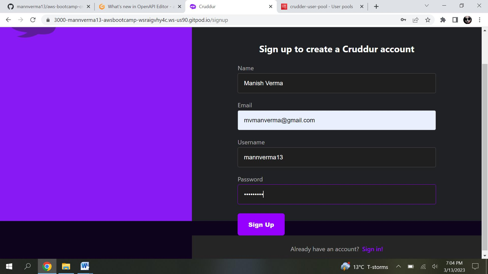

# Week 3 — Decentralized Authentication

Decentralized authentication simply means that there is no central authority needed to verify your identity, i.e., decentralized identifiers. DIDs (Decentralized Identifiers) are a special type of identifier that allows for decentralized, verified digital identification. A DID is any subject identified by the DID's controller (e.g., a person, organization, thing, data model, abstract entity, etc.).
DIDs, unlike traditional federated identifiers, are designed to be independent of centralized registries, identity providers, and certificate authorities.

AWS cognito- is such service provder which helps to identify user identiity .With Amazon Cognito, you can add user sign-up and sign-in features and control access to your web and mobile applications. Amazon Cognito provides an identity store that scales to millions of users, supports social and enterprise identity federation, and offers advanced security features to protect your consumers and business. Built on open identity standards, Amazon Cognito supports various compliance regulations and integrates with frontend and backend development resources.

# Amazon Cognito user pool-
Amazon Cognito user pools makes it easy to create and maintain a user directory and add sign-up (user on-boarding) and sign-in to your mobile or web application for authentication, authorization, and resource access and control.
# Amazon Cognito identity pool-
With Amazon Cognito identity pools, you can create unique identities and assign permissions for users. You can also sign in users through social identity providers, such as Facebook, Google, or Apple, or through corporate identity providers with SAML or OIDC and control access to your backend resources.

For our project we created a user pool and used it for stroring identulty of our app users.

First step is to create user poll using AWs console. Alternately we can use  AWS CLI also to create user pool.

Followed Andrew's instruction from the sesssion to create user pool. USer created with option of Name and preferreed name . Prefferred name can be seen in app rigth bottom after signup.

imapge- user pool
image- client id

# AWS Amplify-
AWS Amplify is a complete solution that lets frontend web and mobile developers easily build, ship, and host full-stack applications on AWS. It provdes various option to work with differen frameworks and lanuguages. For our project we will be using it integrate with Flask .

Install AWS Amplify --> cd into frontend-react-js

```
npm i aws-amplify --save
```
Adding belo code in frontend APP.JS

```js
import { Amplify } from 'aws-amplify';

Amplify.configure({
  "AWS_PROJECT_REGION": process.env.REACT_APP_AWS_PROJECT_REGION,
  "aws_cognito_region": process.env.REACT_APP_AWS_COGNITO_REGION,
  "aws_user_pools_id": process.env.REACT_APP_AWS_USER_POOLS_ID,
  "aws_user_pools_web_client_id": process.env.REACT_APP_CLIENT_ID,
  "oauth": {},
  Auth: {
    // We are not using an Identity Pool
    // identityPoolId: process.env.REACT_APP_IDENTITY_POOL_ID, // REQUIRED - Amazon Cognito Identity Pool ID
    region: process.env.REACT_AWS_PROJECT_REGION, // REQUIRED - Amazon Cognito Region
    userPoolId: process.env.REACT_APP_AWS_USER_POOLS_ID,  // OPTIONAL - Amazon Cognito User Pool ID
    userPoolWebClientId: process.env.REACT_APP_CLIENT_ID,  // OPTIONAL - Amazon Cognito Web Client ID (26-char alphanumeric string)
  }
});
```

Setting up env variable in docker compose.yml file for codgnito

```yaml
frontend-react-js:
    environment:
      REACT_APP_BACKEND_URL: "https://4567-${GITPOD_WORKSPACE_ID}.${GITPOD_WORKSPACE_CLUSTER_HOST}"
      REACT_APP_AWS_PROJECT_REGION: "${AWS_DEFAULT_REGION}"
      REACT_APP_AWS_COGNITO_REGION: "${AWS_DEFAULT_REGION}"
      REACT_APP_AWS_USER_POOLS_ID: "us-east-1_cnovgbqXm"
      REACT_APP_CLIENT_ID: "3f9l50njb14rde0bc33dr4ufpf"
    build: ./frontend-react-js
    ports:
      - "3000:3000"
    volumes:
      - ./frontend-react-js:/frontend-react-js
````

To Conditionally Show Logged in or Logged out HomeFeedPage . Add below piece in  HomeFeedPage.js

```js
// check if we are authenicated
const checkAuth = async () => {
  Auth.currentAuthenticatedUser({
    // Optional, By default is false. 
    // If set to true, this call will send a 
    // request to Cognito to get the latest user data
    bypassCache: false 
  })
  .then((user) => {
    console.log('user',user);
    return Auth.currentAuthenticatedUser()
  }).then((cognito_user) => {
      setUser({
        display_name: cognito_user.attributes.name,
        handle: cognito_user.attributes.preferred_username
      })
  })
  .catch((err) => console.log(err));
};
```
 Update ProfileInfo.js  to use AWS Aplifiy
```js
// remove Cookies from "js-cookie and replace with code below
import { Auth } from 'aws-amplify';
const signOut = async () => {
  try {
      await Auth.signOut({ global: true });
      window.location.href = "/"
  } catch (error) {
      console.log('error signing out: ', error);
  }
}
```
  Update SignIn Page with Amplify Auth
```js
// replace cookies with auth from aws-amplify
import { Auth } from 'aws-amplify';
// const [cognitoErrors, setCognitoErrors] = React.useState('');
const onsubmit = async (event) => {
  setErrors('')
  event.preventDefault();
    Auth.signIn(email, password)
      .then(user => {
        localStorage.setItem("access_token", user.signInUserSession.accessToken.jwtToken)
        window.location.href = "/"
      })
      .catch(err => {
          if (error.code == 'UserNotConfirmedException') {
      window.location.href = "/confirm"
      }
    setErrors(error.message)
  });
  return false
}
let errors;
if (Errors){
  errors = <div className='errors'>{Errors}</div>;
}
```
   Update Signup Page with Amplify Auth
```js
import { Auth } from 'aws-amplify';
//const [cognitoErrors, setCognitoErrors] = React.useState('');
  const onsubmit = async (event) => {
    event.preventDefault();
    setErrors('')
    console.log('username',username)
    console.log('email',email)
    console.log('name',name)
    try {
      const { user } = await Auth.signUp({
        username: email,
        password: password,
        attributes: {
          name: name,
          email: email,
          preferred_username: username,
        },
        autoSignIn: { // optional - enables auto sign in after user is confirmed
          enabled: true,
        }
      });
      console.log(user);
      window.location.href = `/confirm?email=${email}`
    } catch (error) {
        console.log(error);
        setErrors(error.message)
    }
    return false
  }
```
  Update Confirmation Page to handle Auth to resend email
```js
import { Auth } from 'aws-amplify';
const resend_code = async (event) => {
  setErrors('')
  try {
    await Auth.resendSignUp(email);
    console.log('code resent successfully');
    setCodeSent(true)
  } catch (err) {
    // does not return a code
    // does cognito always return english
    // for this to be an okay match?
    console.log(err)
    if (err.message == 'Username cannot be empty'){
      setErrors("You need to provide an email in order to send Resend Activiation Code")   
    } else if (err.message == "Username/client id combination not found."){
      setErrors("Email is invalid or cannot be found.")   
    }
  }
}
const onsubmit = async (event) => {
  event.preventDefault();
  setErrors('')
  try {
    await Auth.confirmSignUp(email, code);
    window.location.href = "/"
  } catch (error) {
    setErrors(error.message)
  }
  return false
}
```
  Update Recovery Page
```js
import { Auth } from 'aws-amplify';
const onsubmit_send_code = async (event) => {
  event.preventDefault();
  setErrors('')
  Auth.forgotPassword(username)
  .then((data) => setFormState('confirm_code') )
  .catch((err) => setErrors(err.message) );
  return false
}
const onsubmit_confirm_code = async (event) => {
  event.preventDefault();
  setErrors('')
  if (password == passwordAgain){
    Auth.forgotPasswordSubmit(username, code, password)
    .then((data) => setFormState('success'))
    .catch((err) => setErrors(err.message) );
  } else {
    setErrors('Passwords do not match')
  }
  return false
}
```
# Once setup is done to use amplify auth. use below step to signup new user and verification.

1. Create new user by clicking on jion now page on cruddur app. Add all details click on signup.
2. A confirmattion page will pop up, which require a otp to be entered .please check email used while signing up for code.
3. Enter confirmation code and user will be confirmed. Same can be confirmed in AWS cognito.
4. Login with user email and passowrd used while signup.

# forget password 
1. Use recovery page to reset the password.
   Enter email to send recovey code, click on recovery code a popup comes to enter a conrimation code and set new password.
2. Enter code recieved on email , enters new password and click on reset  password button.
   Your password ha been reset succefully confirmation message displayed.
3. Use new password to logon to cruddur app.

# Implementing Cogntio  with server side verification

1. pass access token to backend falsk. add belo code in frontend --> homeffeed. js 
```js
const loadData = async () => {
    try {
      const backend_url = `${process.env.REACT_APP_BACKEND_URL}/api/activities/home`
      const res = await fetch(backend_url, {
        headers: {
          Authorization: `Bearer ${localStorage.getItem("access_token")}`
        },
        method: "GET"
      });
      let resJson = await res.json();
      if (res.status === 200) {
        setActivities(resJson)
      } else {
        console.log(res)
      }
    } catch (err) {
      console.log(err);
    }
  };
```
2. token verfication-Token Verification 
Create a folder name lib on the backend-flask directory and create a file inside cognito_jwt_token.py and add below code. this is used to verify the access token.

CognitoJwtToken is used to is used to verify a JWT (JSON Web Token) obtained from an Amazon Cognito user pool . in case of any erro it will through customer erro messages. it will also extract access token for auth header sent from AWs cognito.

```.js
import time
import requests
from jose import jwk, jwt
from jose.exceptions import JOSEError
from jose.utils import base64url_decode

class FlaskAWSCognitoError(Exception):
  pass

class TokenVerifyError(Exception):
  pass

def extract_access_token(request_headers):
    access_token = None
    auth_header = request_headers.get("Authorization")
    if auth_header and " " in auth_header:
        _, access_token = auth_header.split()
    return access_token

class CognitoJwtToken:
    def __init__(self, user_pool_id, user_pool_client_id, region, request_client=None):
        self.region = region
        if not self.region:
            raise FlaskAWSCognitoError("No AWS region provided")
        self.user_pool_id = user_pool_id
        self.user_pool_client_id = user_pool_client_id
        self.claims = None
        if not request_client:
            self.request_client = requests.get
        else:
            self.request_client = request_client
        self._load_jwk_keys()


    def _load_jwk_keys(self):
        keys_url = f"https://cognito-idp.{self.region}.amazonaws.com/{self.user_pool_id}/.well-known/jwks.json"
        try:
            response = self.request_client(keys_url)
            self.jwk_keys = response.json()["keys"]
        except requests.exceptions.RequestException as e:
            raise FlaskAWSCognitoError(str(e)) from e

    @staticmethod
    def _extract_headers(token):
        try:
            headers = jwt.get_unverified_headers(token)
            return headers
        except JOSEError as e:
            raise TokenVerifyError(str(e)) from e

    def _find_pkey(self, headers):
        kid = headers["kid"]
        # search for the kid in the downloaded public keys
        key_index = -1
        for i in range(len(self.jwk_keys)):
            if kid == self.jwk_keys[i]["kid"]:
                key_index = i
                break
        if key_index == -1:
            raise TokenVerifyError("Public key not found in jwks.json")
        return self.jwk_keys[key_index]

    @staticmethod
    def _verify_signature(token, pkey_data):
        try:
            # construct the public key
            public_key = jwk.construct(pkey_data)
        except JOSEError as e:
            raise TokenVerifyError(str(e)) from e
        # get the last two sections of the token,
        # message and signature (encoded in base64)
        message, encoded_signature = str(token).rsplit(".", 1)
        # decode the signature
        decoded_signature = base64url_decode(encoded_signature.encode("utf-8"))
        # verify the signature
        if not public_key.verify(message.encode("utf8"), decoded_signature):
            raise TokenVerifyError("Signature verification failed")

    @staticmethod
    def _extract_claims(token):
        try:
            claims = jwt.get_unverified_claims(token)
            return claims
        except JOSEError as e:
            raise TokenVerifyError(str(e)) from e

    @staticmethod
    def _check_expiration(claims, current_time):
        if not current_time:
            current_time = time.time()
        if current_time > claims["exp"]:
            raise TokenVerifyError("Token is expired")  # probably another exception

    def _check_audience(self, claims):
        # and the Audience  (use claims['client_id'] if verifying an access token)
        audience = claims["aud"] if "aud" in claims else claims["client_id"]
        if audience != self.user_pool_client_id:
            raise TokenVerifyError("Token was not issued for this audience")

    def verify(self, token, current_time=None):
        """ https://github.com/awslabs/aws-support-tools/blob/master/Cognito/decode-verify-jwt/decode-verify-jwt.py """
        if not token:
            raise TokenVerifyError("No token provided")

        headers = self._extract_headers(token)
        pkey_data = self._find_pkey(headers)
        self._verify_signature(token, pkey_data)

        claims = self._extract_claims(token)
        self._check_expiration(claims, current_time)
        self._check_audience(claims)

        self.claims = claims 
        return claims
  ```
  
3. Update requirements.txt
```
Flask-AWSCognito
```
run command in cli to update the dependencies
```
pip install -r requirements.txt
```

4.  Update the env vars for the backend flask in dcocker compose.yml file.
 
 '''yaml
AWS_COGNITO_USER_POOL_CLIENT_ID: ""
AWS_COGNITO_USER_POOL_ID: ""
 ```
5.  Update app.py 

```py
## add call to use cogntion jwt token sctipt
from lib.cognito_jwt_token import CognitoJwtToken, extract_access_token, TokenVerifyError

## allow the env vars  
----------------------
app = Flask(__name__)
----------------------

cognito_jwt_token = CognitoJwtToken(
  user_pool_id=os.getenv("AWS_COGNITO_USER_POOL_ID"), 
  user_pool_client_id=os.getenv("AWS_COGNITO_USER_POOL_CLIENT_ID"),
  region=os.getenv("AWS_DEFAULT_REGION")
)

## add api/activities/home") --> update with the following code
@app.route("/api/activities/home", methods=['GET'])
@xray_recorder.capture('activities_home')
def data_home():
  access_token = extract_access_token(request.headers)
  try:
    claims = cognito_jwt_token.verify(access_token)
    # authenicatied request
    app.logger.debug("authenicated")
    app.logger.debug(claims)
    app.logger.debug(claims['username'])
    data = HomeActivities.run(cognito_user_id=claims['username'])
  except TokenVerifyError as e:
    # unauthenicatied request
    app.logger.debug(e)
    app.logger.debug("unauthenicated")
    data = HomeActivities.run()
  return data, 200

Below code is added to homeactivities. py  . If user is validate succesfully a custom message is displayed on UI.


```py
def run(cognito_user_id=None):

if cognito_user_id != None:
  extra_crud = {
    'uuid': '248959df-3079-4947-b847-9e0892d1bab4',
    'handle':  'Lore',
    'message': 'My dear brother, it the humans that are the problem',
    'created_at': (now - timedelta(hours=1)).isoformat(),
    'expires_at': (now + timedelta(hours=12)).isoformat(),
    'likes': 1042,
    'replies': []
  }
  results.insert(0,extra_crud)
  ```

 screen proofs after implementation of cognito and JWT
 
 User pool creation
 
 
 
 Signup
 
 Password reset
 
 
 
 
 
 sign on
 
 signout
 
 
 authentication log
 
 
 AWS console - successful user creation
 
 
 
 


