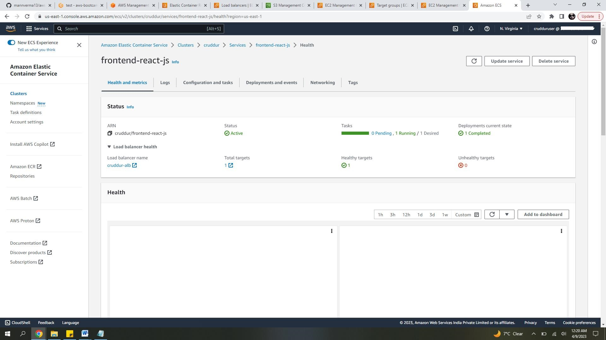
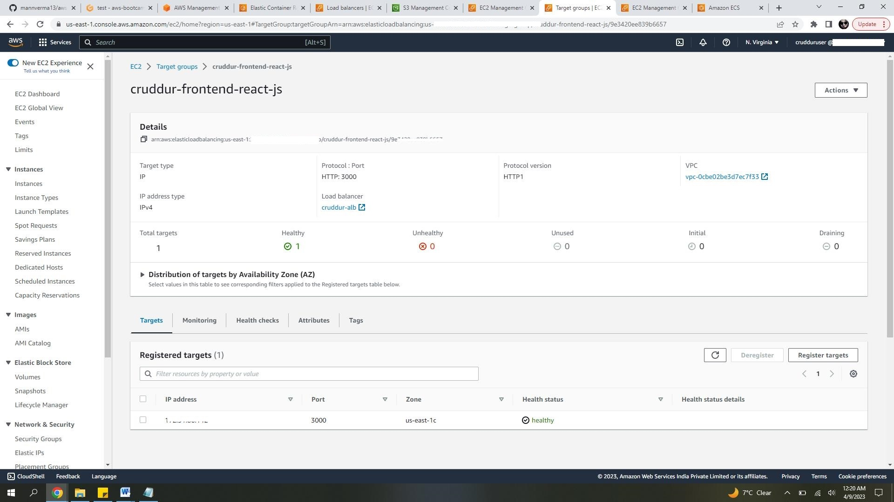

# Week 6 — Deploying Containers

This week we deployed our container on AWs infrastructure.
ECS is the sevice provided by AWS for contanirization. WE have used fargate of our project.
AWS Fargate is a serverless, pay-as-you-go compute engine that lets you focus on building applications without managing servers.  We don't have worried about compute capacity pr provisioning of addtional recources for our images. Fargate is compatible with both  ECS and EKS.

We performed below activities to create container images  in ECS.

1. Created a test script to tes RDS connection
   Script stored at  bin/db/test

```sh
#!/usr/bin/env python3

import psycopg
import os
import sys

connection_url = os.getenv("CONNECTION_URL")

conn = None
try:
  print('attempting connection')
  conn = psycopg.connect(connection_url)
  print("Connection successful!")
except psycopg.Error as e:
  print("Unable to connect to the database:", e)
finally:
  conn.close()
 ```
 
 2. Created a helath-check file to test if backend-flask server is working fine after deplying our image.
    Script stored at backend/bin/health-check
    Update app.py file to route to api/health-check endpoint.IF response is 200 , indicates falsk server is running fine.
 3. create ECR repository for python image.
```sh
    aws ecs create-cluster \
--cluster-name cruddur \
--service-connect-defaults namespace=cruddur
```
 4. Create a script for ECr login .This is needed to pull and push images to ECS containers
    Script stored at bin/ecr/login
```sh
    #! /usr/bin/bash

 aws ecr get-login-password --region $AWS_DEFAULT_REGION | docker login --username AWS --password-stdin "$AWS_ACCOUNT_ID.dkr.ecr.$AWS_DEFAULT_REGION.amazonaws.com"
```
 5. Created a cloudwatch log group for captuirng logs for containers.
```sh
aws logs create-log-group --log-group-name cruddur
aws logs put-retention-policy --log-group-name cruddur --retention-in-days 1
```
 6. Created ECS cluseter for our services and a security group for the cluster.
 ```sh
 aws ecs create-cluster \
--cluster-name cruddur \
--service-connect-defaults namespace=cruddur
```

```sh
export CRUD_CLUSTER_SG=$(aws ec2 create-security-group \
  --group-name cruddur-ecs-cluster-sg \
  --description "Security group for Cruddur ECS ECS cluster" \
  --vpc-id $DEFAULT_VPC_ID \
  --query "GroupId" --output text)
echo $CRUD_CLUSTER_SG
```

 7. To build/tag and push backend and frontend application scripts are created and stored in bin/backend and bin/frontend  folders.   
 
 8. Create a new IAM role to provide execution role for creating task definition.
   role name- CruddurServiceExecutionRole 
   attached policty from  aws/policies/service-execution-policy.json to the role created.
   
 9. Created task defintions for backedn and frontend application.  To register the taks defintions in ECS script created and stored in Bin/backend/register for backend-flask and bin/frontend/register for frontend-react-js.
   backend-flask.json
   ```json
   {
    "family": "backend-flask",
    "executionRoleArn": "arn:aws:iam::AWS_ACCOUNT_ID:role/CruddurServiceExecutionRole",
    "taskRoleArn": "arn:aws:iam::AWS_ACCOUNT_ID:role/CruddurTaskRole",
    "networkMode": "awsvpc",
    "cpu": "256",
    "memory": "512",
    "requiresCompatibilities": [ 
      "FARGATE" 
    ],
    "containerDefinitions": [
      {
        "name": "xray",
        "image": "public.ecr.aws/xray/aws-xray-daemon" ,
        "essential": true,
        "user": "1337",
        "portMappings": [
          {
            "name": "xray",
            "containerPort": 2000,
            "protocol": "udp"
          }
        ]
      },
      {
        "name": "backend-flask",
        "image": "AWS_ACCOUNT_ID.dkr.ecr.us-east-1.amazonaws.com/backend-flask",
        "essential": true,
        "healthCheck": {
          "command": [
            "CMD-SHELL",
            "python /backend-flask/bin/health-check"
          ],
          "interval": 30,
          "timeout": 5,
          "retries": 3,
          "startPeriod": 60
        },
        "portMappings": [
          {
            "name": "backend-flask",
            "containerPort": 4567,
            "protocol": "tcp", 
            "appProtocol": "http"
          }
        ],
        "logConfiguration": {
          "logDriver": "awslogs",
          "options": {
              "awslogs-group": "cruddur",
              "awslogs-region": "us-east-1",
              "awslogs-stream-prefix": "backend-flask"
          }
        },
        "environment": [
          {"name": "OTEL_SERVICE_NAME", "value": "backend-flask"},
          {"name": "OTEL_EXPORTER_OTLP_ENDPOINT", "value": "https://api.honeycomb.io"},
          {"name": "AWS_COGNITO_USER_POOL_ID", "value": "us-east-1_********"},
          {"name": "AWS_COGNITO_USER_POOL_CLIENT_ID", "value": "3f9l50njb14rde0bc33dr4ufpf"},
          {"name": "FRONTEND_URL", "value": "https://cruddurproject.xyz"},
          {"name": "BACKEND_URL", "value": "https://api.cruddurproject.xyz"},
          {"name": "AWS_DEFAULT_REGION", "value": "us-east-1"}
        ],
        "secrets": [
          {"name": "AWS_ACCESS_KEY_ID"    , "valueFrom": "arn:aws:ssm:us-east-1:AWS_ACCOUNT_ID:parameter/cruddur/backend-flask/AWS_ACCESS_KEY_ID"},
          {"name": "AWS_SECRET_ACCESS_KEY", "valueFrom": "arn:aws:ssm:us-east-1:AWS_ACCOUNT_ID:parameter/cruddur/backend-flask/AWS_SECRET_ACCESS_KEY"},
          {"name": "CONNECTION_URL"       , "valueFrom": "arn:aws:ssm:us-east-1:AWS_ACCOUNT_ID:parameter/cruddur/backend-flask/CONNECTION_URL" },
          {"name": "ROLLBAR_ACCESS_TOKEN" , "valueFrom": "arn:aws:ssm:us-east-1:AWS_ACCOUNT_ID:parameter/cruddur/backend-flask/ROLLBAR_ACCESS_TOKEN" },
          {"name": "OTEL_EXPORTER_OTLP_HEADERS" , "valueFrom": "arn:aws:ssm:us-east-1:AWS_ACCOUNT_ID:parameter/cruddur/backend-flask/OTEL_EXPORTER_OTLP_HEADERS" }
        ]
      }
    ]
  }
```

10. To create sevice on cluster created above we create a json file.
 service-backend-flask.json
```json
{
  "cluster": "cruddur",
  "launchType": "FARGATE",
  "desiredCount": 1,
  "enableECSManagedTags": true,
  "enableExecuteCommand": true,
  "loadBalancers": [
    {
        "targetGroupArn": "arn:aws:elasticloadbalancing:us-east-1:AWS_ACCOUNT_ID:targetgroup/cruddur-backend-flask-tg/e868c544ded8c86c",
        "containerName": "backend-flask",
        "containerPort": 4567
    }
  ],
  "networkConfiguration": {
    "awsvpcConfiguration": {
      "assignPublicIp": "ENABLED",
      "securityGroups": [
        "security group created for ECS"
      ],
      "subnets": [
        "subnet-*******",
        "subnet-*******",
        "subnet-*******"
      ]
    }
  },
  "serviceConnectConfiguration": {
    "enabled": true,
    "namespace": "cruddur",
    "services": [
      {
        "portName": "backend-flask",
        "discoveryName": "backend-flask",
        "clientAliases": [{"port": 4567}]
      }
    ]
  },
  "propagateTags": "SERVICE",
  "serviceName": "backend-flask",
  "taskDefinition": "backend-flask"
}
```
 
 for frontend 
 service-frontend-react-js.json
```json
{
    "cluster": "cruddur",
    "launchType": "FARGATE",
    "desiredCount": 1,
    "enableECSManagedTags": true,
    "enableExecuteCommand": true,
    "loadBalancers": [
      {
          "targetGroupArn": "arn:aws:elasticloadbalancing:us-east-1:AWS_ACCOUNT_ID:targetgroup/cruddur-frontend-react-js/9e3420ee839b6657",
          "containerName": "frontend-react-js",
          "containerPort": 3000
      }
    ],
    "networkConfiguration": {
      "awsvpcConfiguration": {
        "assignPublicIp": "ENABLED",
        "securityGroups": [
          "security group created for ECS"
        ],
        "subnets": [
          "subnet-********",
          "subnet-********",
          "subnet-********"
        ]
      }
    },
    "propagateTags": "SERVICE",
    "serviceName": "frontend-react-js",
    "taskDefinition": "frontend-react-js",
    "serviceConnectConfiguration": {
      "enabled": true,
      "namespace": "cruddur",
      "services": [
        {
          "portName": "frontend-react-js",
          "discoveryName": "frontend-react-js",
          "clientAliases": [{"port": 3000}]
        }
      ]
    }
  }
```

11. To create service use below commands.
```sh
backend
aws ecs create-service --cli-input-json file://aws/json/service-backend-flask.json
```
    


12. Update security group inboud rule to allow traffice from port 4567 .
    
    Use backend-flask container pubil IP address and check health status.
    
    
    

13.  Setting up Load balancer for frontend and backend applications acrros availibilty zones.
     Created a new load balancer with name -cruddur-alb  with  security group cruddur-alb-sg.
     Inbound rule is et to allow traffice from customer TCP port 4567 amd port 3000 .
     Updated iboubd rule to allow traffice from custom prot with source as security group. 
     Created 2 target groups 'cruddur-backend-flask-tg' and 'cruddur-frontend-react-js-tg' to use HTTP protocol and connect on port 4567 $ 3000 repectively.
     Added a '/api/health-check' for the backend traget gorup.
     Add these traget groups to the load balancer.
     
 All traffice will flow now through load balancers with targer groups. Verified able to connect to application using load baclncer DNS with backend 4567 endpoint.
 
   
    
     
14. set up for frontend-react applcation
     
 Create task definition for frontend app. Json file stored in aws/task-definitions/frontend-react-js.json.
 frontend-react-js.json
 ```json
  {
    "family": "frontend-react-js",
    "executionRoleArn": "arn:aws:iam::364455495412:role/CruddurServiceExecutionRole",
    "taskRoleArn": "arn:aws:iam::364455495412:role/CruddurTaskRole",
    "networkMode": "awsvpc",
    "cpu": "256",
    "memory": "512",
    "requiresCompatibilities": [ 
      "FARGATE" 
    ],
    "containerDefinitions": [
      {
        "name": "xray",
        "image": "public.ecr.aws/xray/aws-xray-daemon" ,
        "essential": true,
        "user": "1337",
        "portMappings": [
          {
            "name": "xray",
            "containerPort": 2000,
            "protocol": "udp"
          }
        ]
      },
      {
        "name": "frontend-react-js",
        "image": "364455495412.dkr.ecr.us-east-1.amazonaws.com/frontend-react-js",
        "essential": true,
        "healthCheck": {
          "command": [
            "CMD-SHELL",
            "curl -f http://localhost:3000 || exit 1"
          ],
          "interval": 30,
          "timeout": 5,
          "retries": 3
        },
        "portMappings": [
          {
            "name": "frontend-react-js",
            "containerPort": 3000,
            "protocol": "tcp", 
            "appProtocol": "http"
          }
        ],
  
        "logConfiguration": {
          "logDriver": "awslogs",
          "options": {
              "awslogs-group": "cruddur",
              "awslogs-region": "us-east-1",
              "awslogs-stream-prefix": "frontend-react-js"
          }
        }
      }
    ]
  }
```
15.  service file for frontend-react app. 
 frontend-react-js.json
```json 
 {
    "family": "frontend-react-js",
    "executionRoleArn": "arn:aws:iam::AWS_ACCOUNT_ID:role/CruddurServiceExecutionRole",
    "taskRoleArn": "arn:aws:iam::AWS_ACCOUNT_ID:role/CruddurTaskRole",
    "networkMode": "awsvpc",
    "cpu": "256",
    "memory": "512",
    "requiresCompatibilities": [ 
      "FARGATE" 
    ],
    "containerDefinitions": [
      {
        "name": "xray",
        "image": "public.ecr.aws/xray/aws-xray-daemon" ,
        "essential": true,
        "user": "1337",
        "portMappings": [
          {
            "name": "xray",
            "containerPort": 2000,
            "protocol": "udp"
          }
        ]
      },
      {
        "name": "frontend-react-js",
        "image": "AWS_ACCOUNT_ID.dkr.ecr.us-east-1.amazonaws.com/frontend-react-js",
        "essential": true,
        "healthCheck": {
          "command": [
            "CMD-SHELL",
            "curl -f http://localhost:3000 || exit 1"
          ],
          "interval": 30,
          "timeout": 5,
          "retries": 3
        },
        "portMappings": [
          {
            "name": "frontend-react-js",
            "containerPort": 3000,
            "protocol": "tcp", 
            "appProtocol": "http"
          }
        ],
  
        "logConfiguration": {
          "logDriver": "awslogs",
          "options": {
              "awslogs-group": "cruddur",
              "awslogs-region": "us-east-1",
              "awslogs-stream-prefix": "frontend-react-js"
          }
        }
      }
    ]
  }
```
    
16. repeat steps to buildtag and push image. scripts for frontend app is stoered at bin/frontend

able to connect to endpoint 3000 using alb dns and data fetched from  database.

    
  
 
 ## Setup custom domain and connect using route 53.
 
 17. Created a new hosted xone in Route53.
     updated nameserver from where we have bought domain name.
     Created  certificate usign ACM and create a record in hosted Zone.
     Create simple record to rout traffic from domain mane and api.cruddurproject.xyz .

   
   

18. Update load balancer listners to allow traffic from HTTP port 80:   to redirect traffice to port 443.
     Add rule HTTPS on port 443:  to redriect to cruddur-frontend-react-js  traget group.
         
   Able to connect using customer domain post setup.
   
    
 
## setup for x-ray 

20 . Added conaners detail in task defintions for backend and frontend app.
     This will create xray containers in ECS. This is to help teac and loggin put application.

```json
 "containerDefinitions": [
      {
        "name": "xray",
        "image": "public.ecr.aws/xray/aws-xray-daemon" ,
        "essential": true,
        "user": "1337",
        "portMappings": [
          {
            "name": "xray",
            "containerPort": 2000,
            "protocol": "udp"
          }
        ]
      },
```      
          
      
 
          
          
 
 

 
