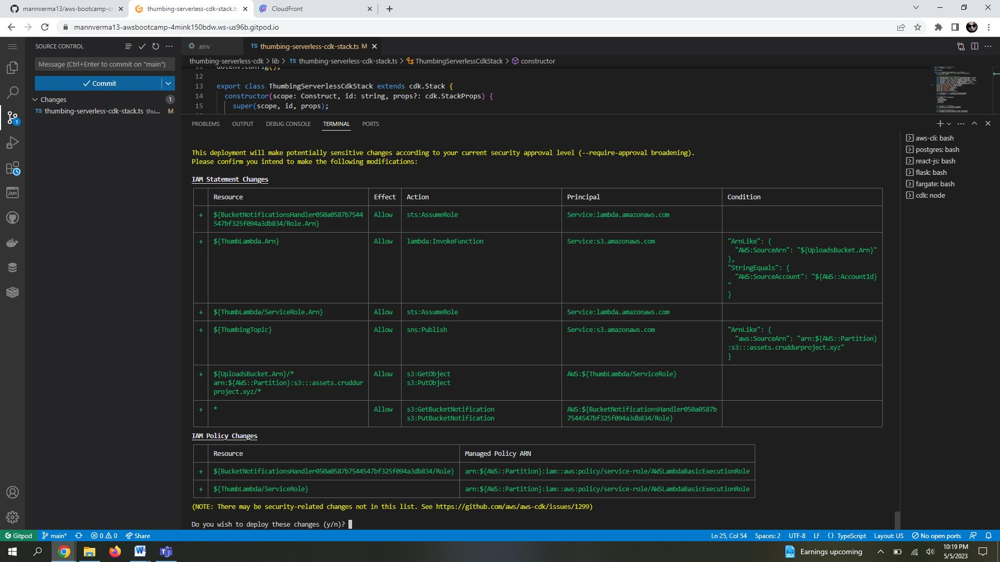
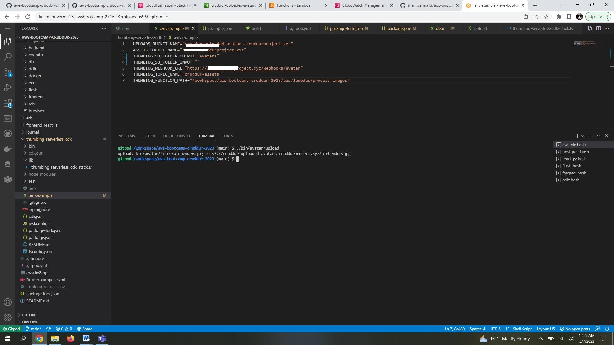
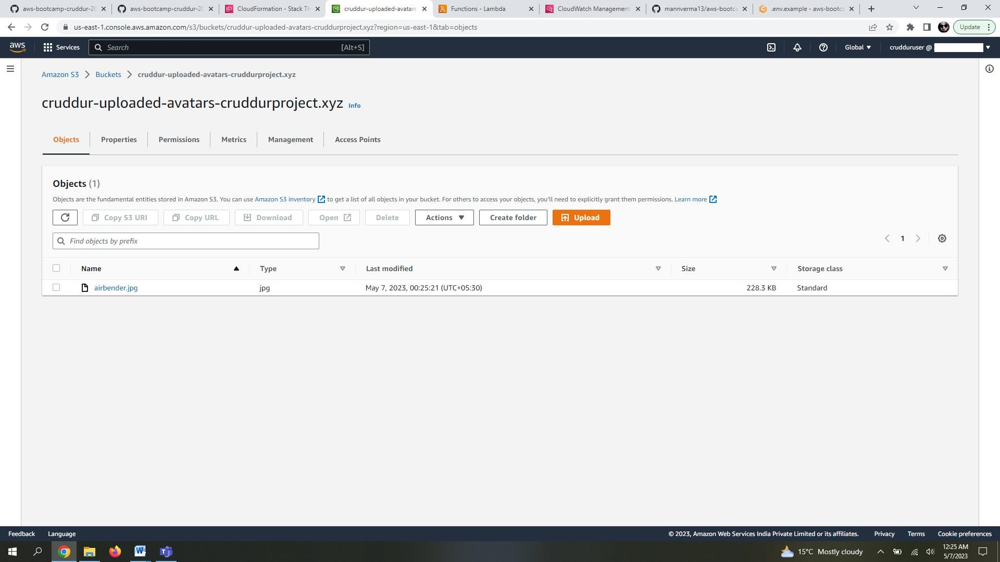
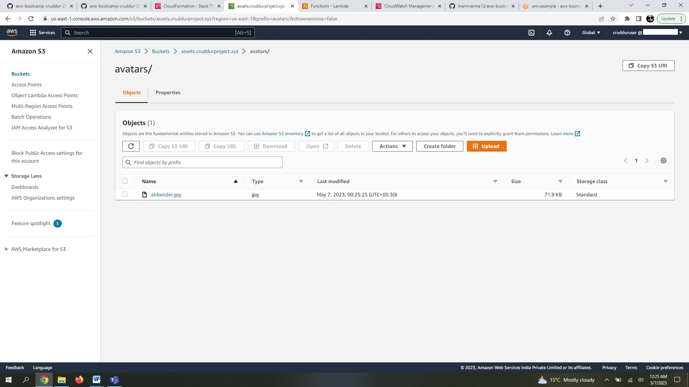
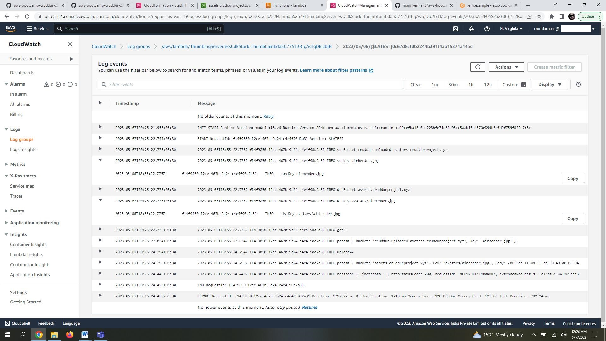
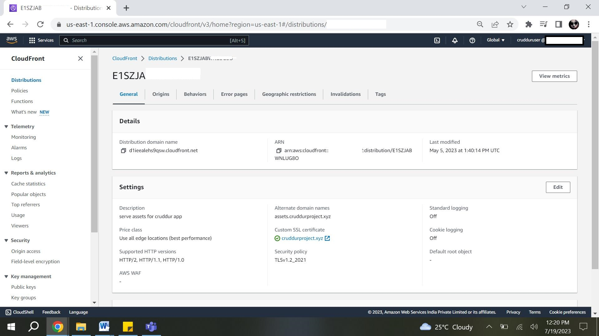
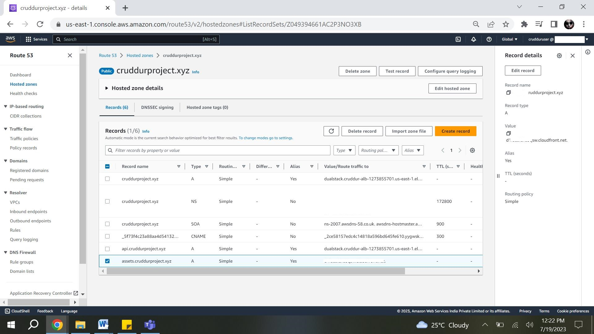
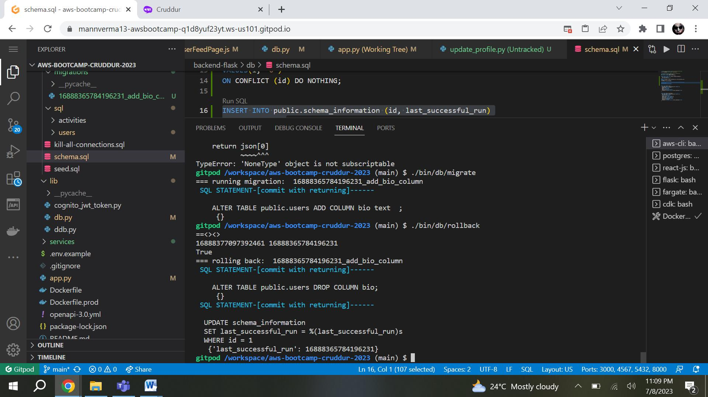
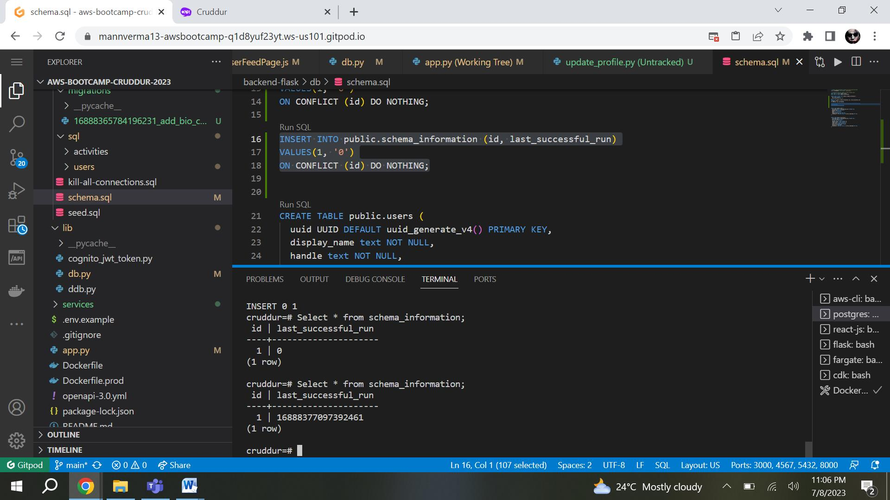
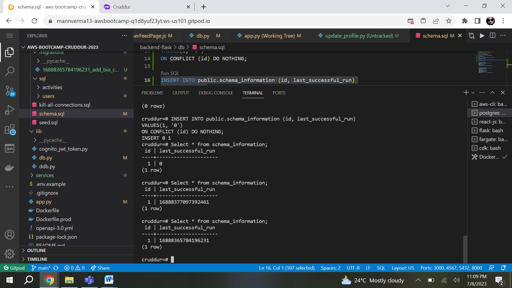

# Week 8 — Serverless Image Processing

## AWS CDK
Wee8 we learn multiple AWS service first to start with AWS  CDK.
CDK is a service to create inrstructure for you application. It provides you the use to create multiple services required for your application.
It is easily reuable where you can create /destroy  and re deploy service fast and easily.CDK use cloud formation in back to provision the resources.

1.  Create a folder in root directoy thumbing-serverless-cdk . We use this folder to install CDK and create the CDK form for deploying the resources to AWS .

```
# to install CDk
npm install aws-cdk -g
# initialize for the languaage used 
cdk init app --language typescript
# To set up the AWS CloudFormation stack that is needed for deploying your CDK application.
cdk bootstrap "aws://$AWS_ACCOUNT_ID/$AWS_DEFAULT_REGION"
# to get a cloud formation template any erro will get to know
cdk synth
#  to deply the CDK stack
cdk deploy
```

2.create an new file thumbing-serverless-cdk-stack.ts and add below code.

Below stack create a serverless aplication in which a image is going to upload to a S3 bucket, which will triggers the lambda function to process the image and upoad processed image to a S3 bucket.  A SNS topic is also gets created wchich will notify for image upload.All necessary peromissions for bucket and lambda function will also get created.

```
import * as cdk from 'aws-cdk-lib';
import * as s3 from 'aws-cdk-lib/aws-s3';
import * as iam from 'aws-cdk-lib/aws-iam';
import * as lambda from 'aws-cdk-lib/aws-lambda';
import * as s3n from 'aws-cdk-lib/aws-s3-notifications';
import * as subscriptions from 'aws-cdk-lib/aws-sns-subscriptions';
import * as sns from 'aws-cdk-lib/aws-sns';
import { Construct } from 'constructs';
import * as dotenv from 'dotenv';

dotenv.config();

export class ThumbingServerlessCdkStack extends cdk.Stack {
  constructor(scope: Construct, id: string, props?: cdk.StackProps) {
    super(scope, id, props);

    // The code that defines your stack goes here
    const uploadsBucketName: string = process.env.UPLOADS_BUCKET_NAME as string;
    const assetsBucketName: string = process.env.ASSETS_BUCKET_NAME as string;
    const folderInput: string = process.env.THUMBING_S3_FOLDER_INPUT as string;
    const folderOutput: string = process.env.THUMBING_S3_FOLDER_OUTPUT as string;
    const webhookUrl: string = process.env.THUMBING_WEBHOOK_URL as string;
    const topicName: string = process.env.THUMBING_TOPIC_NAME as string;
    const functionPath: string = process.env.THUMBING_FUNCTION_PATH as string;
    console.log('uploadsBucketName',uploadsBucketName)
    console.log('assetsBucketName',assetsBucketName)
    console.log('folderInput',folderInput)
    console.log('folderOutput',folderOutput)
    console.log('webhookUrl',webhookUrl)
    console.log('topicName',topicName)
    console.log('functionPath',functionPath)

    const uploadsBucket = this.createBucket(uploadsBucketName);
    const assetsBucket = this.importBucket(assetsBucketName);

    // create a lambda
    const lambda = this.createLambda(
      functionPath, 
      uploadsBucketName, 
      assetsBucketName, 
      folderInput, 
      folderOutput
    );

    // create topic and subscription
    const snsTopic = this.createSnsTopic(topicName)
    this.createSnsSubscription(snsTopic,webhookUrl)

    // add our s3 event notifications
    this.createS3NotifyToLambda(folderInput,lambda,uploadsBucket)
    this.createS3NotifyToSns(folderOutput,snsTopic,assetsBucket)

    // create policies
    const s3UploadsReadWritePolicy = this.createPolicyBucketAccess(uploadsBucket.bucketArn)
    const s3AssetsReadWritePolicy = this.createPolicyBucketAccess(assetsBucket.bucketArn)
    //const snsPublishPolicy = this.createPolicySnSPublish(snsTopic.topicArn)

    // attach policies for permissions
    lambda.addToRolePolicy(s3UploadsReadWritePolicy);
    lambda.addToRolePolicy(s3AssetsReadWritePolicy);
    //lambda.addToRolePolicy(snsPublishPolicy);
  }

  createBucket(bucketName: string): s3.IBucket {
    const bucket = new s3.Bucket(this, 'UploadsBucket', {
      bucketName: bucketName,
      removalPolicy: cdk.RemovalPolicy.DESTROY
    });
    return bucket;
  }

  importBucket(bucketName: string): s3.IBucket {
    const bucket = s3.Bucket.fromBucketName(this,"AssetsBucket",bucketName);
    return bucket;
  }

  createLambda(functionPath: string, uploadsBucketName: string, assetsBucketName: string, folderInput: string, folderOutput: string): lambda.IFunction {
    const lambdaFunction = new lambda.Function(this, 'ThumbLambda', {
      runtime: lambda.Runtime.NODEJS_18_X,
      handler: 'index.handler',
      code: lambda.Code.fromAsset(functionPath),
      environment: {
        DEST_BUCKET_NAME: assetsBucketName,
        FOLDER_INPUT: folderInput,
        FOLDER_OUTPUT: folderOutput,
        PROCESS_WIDTH: '512',
        PROCESS_HEIGHT: '512'
      }
    });
    return lambdaFunction;
  } 

  createS3NotifyToLambda(prefix: string, lambda: lambda.IFunction, bucket: s3.IBucket): void {
    const destination = new s3n.LambdaDestination(lambda);
    bucket.addEventNotification(
      s3.EventType.OBJECT_CREATED_PUT,
      destination//,
      //{prefix: prefix} // folder to contain the original images
    )
  }

  createPolicyBucketAccess(bucketArn: string){
    const s3ReadWritePolicy = new iam.PolicyStatement({
      actions: [
        's3:GetObject',
        's3:PutObject',
      ],
      resources: [
        `${bucketArn}/*`,
      ]
    });
    return s3ReadWritePolicy;
  }

  createSnsTopic(topicName: string): sns.ITopic{
    const logicalName = "ThumbingTopic";
    const snsTopic = new sns.Topic(this, logicalName, {
      topicName: topicName
    });
    return snsTopic;
  }

  createSnsSubscription(snsTopic: sns.ITopic, webhookUrl: string): sns.Subscription {
    const snsSubscription = snsTopic.addSubscription(
      new subscriptions.UrlSubscription(webhookUrl)
    )
    return snsSubscription;
  }

  createS3NotifyToSns(prefix: string, snsTopic: sns.ITopic, bucket: s3.IBucket): void {
    const destination = new s3n.SnsDestination(snsTopic)
    bucket.addEventNotification(
      s3.EventType.OBJECT_CREATED_PUT, 
      destination,
      {prefix: prefix}
    );
  }

  /*
  createPolicySnSPublish(topicArn: string){
    const snsPublishPolicy = new iam.PolicyStatement({
      actions: [
        'sns:Publish',
      ],
      resources: [
        topicArn
      ]
    });
    return snsPublishPolicy;
  }
  */
}
```
Screenshot for proofs.





 
## Serving Avatars via CloudFront

Implemented below steps to serve images using cloudfront.

Create a new cloudfront distribution.
1. Update "Origin Domain Name" field, enter the endpoint for your asset bucket.2.
2. In "Viewer Protocol Policy" section, select "Redirect HTTP to HTTPS" to enforce HTTPS for all viewer requests.
3. Create custom SSl certificate like created for Rout3 53 and it under ' custom SSL certificate section
In the "Alternate Domain Names (CNAMEs)" section, added the s3 bucket domain name like assets.<your_domain_name>.
Leave the "Default Root Object" field blank.
4. add a invlaidation to always allow server latest image uploaded by user.
5. Update S3 bucket policy to allow aOnce your distribution is created, navigate to your S3 bucket and update its bucket policy to allow access from your CloudFront distribution.
```
{
    "Version": "2008-10-17",
    "Id": "PolicyForCloudFrontPrivateContent",
    "Statement": [
        {
            "Sid": "AllowCloudFrontServicePrincipal",
            "Effect": "Allow",
            "Principal": {
                "Service": "cloudfront.amazonaws.com"
            },
            "Action": "s3:GetObject",
            "Resource": "arn:aws:s3:::assets.cruddurproject.xyz/*",
            "Condition": {
                "StringEquals": {
                    "AWS:SourceArn": "arn:aws:cloudfront::**********:distribution/E1SZJABWN*****"
                }
            }
        }
    ]
}
```
6. Create a record via route 53 . to route traffic using cloudfront alias.






## Implementing User Profile Page

### backend changes

1. Update show.sql query to pull cognito user id , cruds_count etc from table . This information is use to get user information while uploading and getting user image from
   bucket. on profile page.
```
SELECT 
  (SELECT COALESCE(row_to_json(object_row),'{}'::json) FROM (
    SELECT
      users.uuid,
      users.cognito_user_id as cognito_user_uuid,
      users.handle,
      users.display_name,
      users.bio,
      (
       SELECT 
        count(true) 
       FROM public.activities
       WHERE
        activities.user_uuid = users.uuid
       ) as cruds_count
  ) object_row) as profile,
  (SELECT COALESCE(array_to_json(array_agg(row_to_json(array_row))),'[]'::json) FROM (
    SELECT
      activities.uuid,
      users.display_name,
      users.handle,
      activities.message,
      activities.created_at,
      activities.expires_at
    FROM public.activities
    WHERE
      activities.user_uuid = users.uuid
    ORDER BY activities.created_at DESC 
    LIMIT 40
  ) array_row) as activities
FROM public.users
WHERE
  users.handle = %(handle)s
```

2. Add an new field bio in users table . Created a new query to update bio information as per cognito user id.
```
UPDATE public.users 
SET 
  bio = %(bio)s,
  display_name= %(display_name)s
WHERE 
  users.cognito_user_id = %(cognito_user_id)s
RETURNING handle;
```

3. added a function in the backend-flask/services/user_activities.py file:  to get user information by calling show.sql query.

```
from lib.db import db

class UserActivities:
  def run(user_handle):
      model = {
        'errors': None,
        'data': None
      }
      if user_handle == None or len(user_handle) < 1:
        model['errors'] = ['blank_user_handle']
      else:
        print("else:")
        sql = db.template('users','show')
        results = db.query_object_json(sql,{'handle': user_handle})
        model['data'] = results
        
      return model
```

4.  update the backend-flask/services/update_profile.py file:  to update bio informatiion in user table. this will call update.sql query.

```
from lib.db import db

class UpdateProfile:
  def run(cognito_user_id,bio,display_name):
    model = {
      'errors': None,
      'data': None
    }

    if display_name == None or len(display_name) < 1:
      model['errors'] = ['display_name_blank']

    if model['errors']:
      model['data'] = {
        'bio': bio,
        'display_name': display_name
      }
    else:
      handle = UpdateProfile.update_profile(bio,display_name,cognito_user_id)
      data = UpdateProfile.query_users_short(handle)
      model['data'] = data
    return model

  def update_profile(bio,display_name,cognito_user_id):
    if bio == None:    
      bio = ''

    sql = db.template('users','update')
    handle = db.query_commit(sql,{
      'cognito_user_id': cognito_user_id,
      'bio': bio,
      'display_name': display_name
    })
  def query_users_short(handle):
    sql = db.template('users','short')
    data = db.query_object_json(sql,{
      'handle': handle
    })
    return data
```

5. Update the backend-flask/app.py file:  to add new route to get user information based on their id and to update user bio information based in their id.
```
from services.update_profile import *

@app.route("/api/profile/update", methods=['POST','OPTIONS'])
@cross_origin()
def data_update_profile():
  bio          = request.json.get('bio',None)
  display_name = request.json.get('display_name',None)
  access_token = extract_access_token(request.headers)
  try:
    claims = cognito_jwt_token.verify(access_token)
    cognito_user_id = claims['sub']
    model = UpdateProfile.run(
      cognito_user_id=cognito_user_id,
      bio=bio,
      display_name=display_name
    )
    if model['errors'] is not None:
      return model['errors'], 422
    else:
      return model['data'], 200
  except TokenVerifyError as e:
    # unauthenicatied request
    app.logger.debug(e)
    return {}, 401

```

### Front end changes

Changes implimented to update profile updatiion.

1. Created new component EditProfileButton.js and created a css file. This is to edit profile for user.
```
#   
import './EditProfileButton.css';

export default function EditProfileButton(props) {
  const pop_profile_form = (event) => {
    event.preventDefault();
    props.setPopped(true);
    return false;
  }

  return (
    <button onClick={pop_profile_form} className='profile-edit-button' href="#">Edit Profile</button>
  );
}
```
2. Created Created new component frontend-react-js/src/components/ProfileHeading.js to display profile header image.
this will pull image from s3 bucket under banner folder.
```
import './ProfileHeading.css';
import EditProfileButton from '../components/EditProfileButton';

export default function ProfileHeading(props) {
  const backgroundImage = 'url("https://assets.cruddur.com/banners/banner.jpg")';
  const styles = {
    backgroundImage: backgroundImage,
    backgroundSize: 'cover',
    backgroundPosition: 'center',
  };
  return (
  <div className='activity_feed_heading profile_heading'>
    <div className='title'>{props.profile.display_name}</div>
    <div className="cruds_count">{props.profile.cruds_count} Cruds</div>
    <div class="banner" style={styles} >
      <div className="avatar">
        </img>
      </div>
    </div>
    <div class="info">
      <div class='id'>
        <div className="display_name">{props.profile.display_name}</div>
        <div className="handle">@{props.profile.handle}</div>
      </div>
      <EditProfileButton setPopped={props.setPopped} />
    </div>
  </div>
  );
}
```

3. Update pages userfeed/notifications/home to get reponse from activity_feed.js 

# Implementing Migration Backend endpoint to update profile.

1. created amigration script to add bio column to to add users table.
   This will take informationn from file placed in backend-flask/migrations/54645747677.py
   
```
### 16888365784196231_add_bio_column.py
from lib.db import db

class AddBioColumnMigration:
  def migrate_sql():
    data = """
    ALTER TABLE public.users ADD COLUMN bio text  ;
    """
    return data
  def rollback_sql():
    data = """
    ALTER TABLE public.users DROP COLUMN bio;
    """
    return data

  def migrate():
    db.query_commit(AddBioColumnMigration.migrate_sql(),{
    })

  def rollback():
    db.query_commit(AddBioColumnMigration.rollback_sql(),{
    })

migration = AddBioColumnMigration
```

```
###migration script
#!/usr/bin/env python3

import os
import sys
import glob
import re
import time
import importlib

current_path = os.path.dirname(os.path.abspath(__file__))
parent_path = os.path.abspath(os.path.join(current_path, '..', '..','backend-flask'))
sys.path.append(parent_path)
from lib.db import db

def get_last_successful_run():
  sql = """
    SELECT last_successful_run
    FROM public.schema_information
    LIMIT 1
  """
  return int(db.query_value(sql,{},verbose=False))

def set_last_successful_run(value):
  sql = """
  UPDATE schema_information
  SET last_successful_run = %(last_successful_run)s
  WHERE id = 1
  """
  db.query_commit(sql,{'last_successful_run': value},verbose=False)
  return value

last_successful_run = get_last_successful_run()

migrations_path = os.path.abspath(os.path.join(current_path, '..', '..','backend-flask','db','migrations'))
sys.path.append(migrations_path)
migration_files = glob.glob(f"{migrations_path}/*")


for migration_file in migration_files:
  filename = os.path.basename(migration_file)
  module_name = os.path.splitext(filename)[0]
  match = re.match(r'^\d+', filename)
  if match:
    file_time = int(match.group())
    if last_successful_run <= file_time:
      mod = importlib.import_module(module_name)
      print('=== running migration: ',module_name)
      mod.migration.migrate()
      timestamp = str(time.time()).replace(".","")
      last_successful_run = set_last_successful_run(timestamp)
```

Rollback script to rollback  changes to last successful run.  this will update timestamp in schem_information table
```
#!/usr/bin/env python3

import os
import sys
import glob
import re
import time
import importlib

current_path = os.path.dirname(os.path.abspath(__file__))
parent_path = os.path.abspath(os.path.join(current_path, '..', '..','backend-flask'))
sys.path.append(parent_path)
from lib.db import db

def get_last_successful_run():
  sql = """
    SELECT last_successful_run
    FROM public.schema_information
    LIMIT 1
  """
  return int(db.query_value(sql,{},verbose=False))

def set_last_successful_run(value):
  sql = """
  UPDATE schema_information
  SET last_successful_run = %(last_successful_run)s
  WHERE id = 1
  """
  db.query_commit(sql,{'last_successful_run': value})
  return value

last_successful_run = get_last_successful_run()

migrations_path = os.path.abspath(os.path.join(current_path, '..', '..','backend-flask','db','migrations'))
sys.path.append(migrations_path)
migration_files = glob.glob(f"{migrations_path}/*")


last_migration_file = None
for migration_file in migration_files:
  if last_migration_file == None:
    filename = os.path.basename(migration_file)
    module_name = os.path.splitext(filename)[0]
    match = re.match(r'^\d+', filename)
    if match:
      file_time = int(match.group())
      print("==<><>")
      print(last_successful_run, file_time)
      print(last_successful_run > file_time)
      if last_successful_run > file_time:
        last_migration_file = module_name
        mod = importlib.import_module(module_name)
        print('=== rolling back: ',module_name)
        mod.migration.rollback()
        set_last_successful_run(file_time)
```

4. added a frontend-react-js/src/components/ProfileForm.js  file. this will upload th image to s3 bucket.
```
import './ProfileForm.css';
import React from "react";
import process from 'process';
import {getAccessToken} from 'lib/CheckAuth';

export default function ProfileForm(props) {
  const [bio, setBio] = React.useState(0);
  const [displayName, setDisplayName] = React.useState(0);

  React.useEffect(()=>{
    console.log('useEffects',props)
    setBio(props.profile.bio);
    setDisplayName(props.profile.display_name);
  }, [props.profile])

  const onsubmit = async (event) => {
    event.preventDefault();
    try {
      const backend_url = `${process.env.REACT_APP_BACKEND_URL}/api/profile/update`
      await getAccessToken()
      const access_token = localStorage.getItem("access_token")
      const res = await fetch(backend_url, {
        method: "POST",
        headers: {
          'Authorization': `Bearer ${access_token}`,
          'Accept': 'application/json',
          'Content-Type': 'application/json'
        },
        body: JSON.stringify({
          bio: bio,
          display_name: displayName
        }),
      });
      let data = await res.json();
      if (res.status === 200) {
        setBio(null)
        setDisplayName(null)
        props.setPopped(false)
      } else {
        console.log(res)
      }
    } catch (err) {
      console.log(err);
    }
  }

  const bio_onchange = (event) => {
    setBio(event.target.value);
  }

  const display_name_onchange = (event) => {
    setDisplayName(event.target.value);
  }

  const close = (event)=> {
    if (event.target.classList.contains("profile_popup")) {
      props.setPopped(false)
    }
  }

  if (props.popped === true) {
    return (
      <div className="popup_form_wrap profile_popup" onClick={close}>
        <form 
          className='profile_form popup_form'
          onSubmit={onsubmit}
        >
          <div class="popup_heading">
            <div class="popup_title">Edit Profile</div>
            <div className='submit'>
              <button type='submit'>Save</button>
            </div>
          </div>
          <div className="popup_content">
            <div className="field display_name">
              <label>Display Name</label>
              <input
                type="text"
                placeholder="Display Name"
                value={displayName}
                onChange={display_name_onchange} 
              />
            </div>
            <div className="field bio">
              <label>Bio</label>
              <textarea
                placeholder="Bio"
                value={bio}
                onChange={bio_onchange} 
              />
            </div>
          </div>
        </form>
      </div>
    );
  }
}
```


.

### Implement Avatar Uploading

Below are steps I followed to  implemtn uploadinf a image to s3 from my app.
1. Create a api end point to upload image using a presigned url  and provide access to S3 bucket bu using authorizer.
  Create two routes - POST /avatars/key_upload with authorizer CruddurJWTAuthorizer and OPTIONS /{proxy+} without authorizer. Theese two routes will be for integration 
  with CruddurAvatarUpload S3 Bucket
3. Create a Lambda function named CruddurAvatarUpload that will decode the URL and the request.
```
require 'aws-sdk-s3'
require 'json'
require 'jwt'

def handler(event:, context:)
  puts event
  # return cors headers for preflight check.
  if event['routeKey'] == "OPTIONS /{proxy+}"
    puts({step: 'preflight', message: 'preflight CORS check'}.to_json)
    { 
      headers: {
        "Access-Control-Allow-Headers": "*, Authorization",
        "Access-Control-Allow-Origin": "https://3000-mannverma13-awsbootcamp-c05nw4dbq8q.ws-us101.gitpod.io",
        "Access-Control-Allow-Methods": "OPTIONS,GET,POST"
      },
      statusCode: 200
    }
  else
    token = event['headers']['authorization'].split(' ')[1]
    
    
    body_hash = JSON.parse(event["body"])
    extension = body_hash["extension"]

    #decoded_token = JWT.decode token, nil, false
    #cognito_user_uuid = decoded_token[0]['sub']
    
    cognito_user_uuid = event["requestContext"]["authorizer"]["lambda"]["sub"]
    puts({step: 'presignedurl', access_token: token}.to_json)

    s3 = Aws::S3::Resource.new
    bucket_name = ENV["UPLOADS_BUCKET_NAME"]
    object_key = "#{cognito_user_uuid}.#{extension}"

    puts({object_key: object_key}.to_json)

    obj = s3.bucket(bucket_name).object(object_key)
    url = obj.presigned_url(:put, expires_in: 60 * 5)
    url # this is the data that will be returned
    body = {url: url}.to_json
    { 
      headers: {
        "Access-Control-Allow-Headers": "*, Authorization",
        "Access-Control-Allow-Origin": "https://3000-mannverma13-awsbootcamp-c05nw4dbq8q.ws-us101.gitpod.io",
        "Access-Control-Allow-Methods": "OPTIONS,GET,POST"
      },
      statusCode: 200, 
      body: body 
    }
  end # if 
end # def handler
```
4. To authorize the request from gitpod url addd a lmabda functinon CruddurApiGatewayLambdaAuthorizer.

```
"use strict";
const { CognitoJwtVerifier } = require("aws-jwt-verify");
//const { assertStringEquals } = require("aws-jwt-verify/assert");

const jwtVerifier = CognitoJwtVerifier.create({
  userPoolId: process.env.USER_POOL_ID,
  tokenUse: "access",
  clientId: process.env.CLIENT_ID, //,
  //customJwtCheck: ({ payload }) => {
  //  assertStringEquals("e-mail", payload["email"], process.env.USER_EMAIL);
  //},
});

exports.handler = async (event) => {
  console.log("request:", JSON.stringify(event, undefined, 2));

  // const jwt = event.headers.authorization;
  const auth = event.headers.authorization;
  const jwt = auth.split(" ")[1];

  try {
    const payload = await jwtVerifier.verify(jwt);
    console.log("Access allowed. JWT payload:", payload);
    return {
      isAuthorized: true,
      context: {
        sub: payload.sub,
      },
    };
  } catch (err) {
    console.error("Access forbidden:", err);
    return {
      isAuthorized: false,
    };
  }
};
```
5. Update permissions of the upload bucket to allow access from gitpod.ip. editing the CORS configuration.
```
[
    {
        "AllowedHeaders": [
            "*"
        ],
        "AllowedMethods": [
            "PUT"
        ],
        "AllowedOrigins": [
            "https://*.gitpod.io"
        ],
        "ExposeHeaders": [
            "x-amz-server-side-encryption",
            "x-amz-request-id",
            "x-amz-id-2"
        ],
        "MaxAgeSeconds": 3000
    }
]
```
6. update the api getway endpoint in our env file.

.
.
.
.
.
.
.

