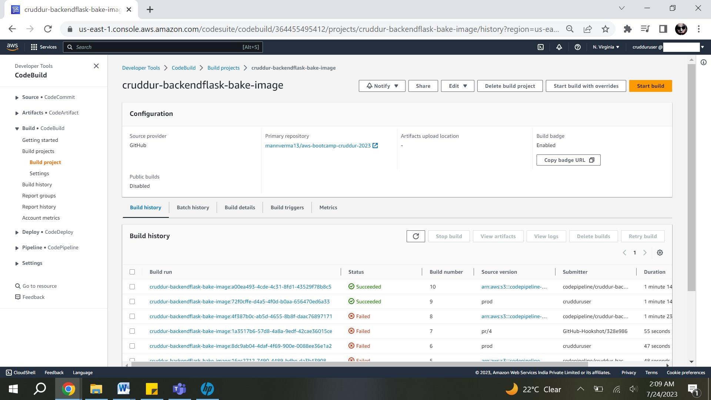
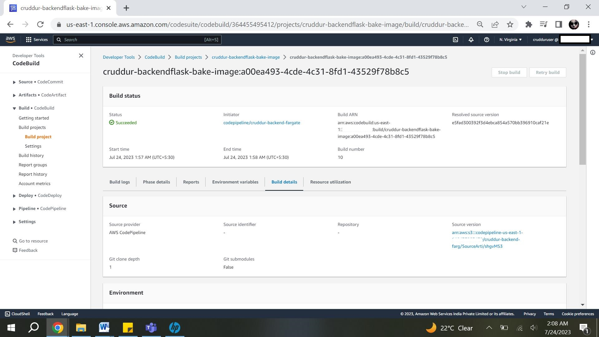
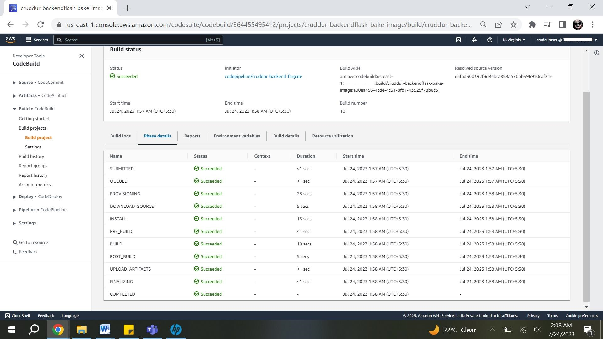
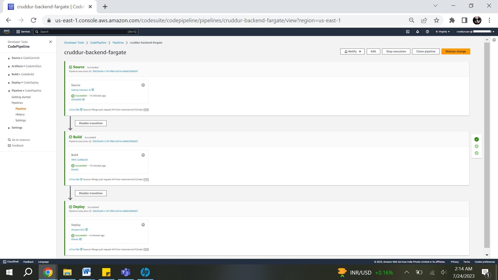
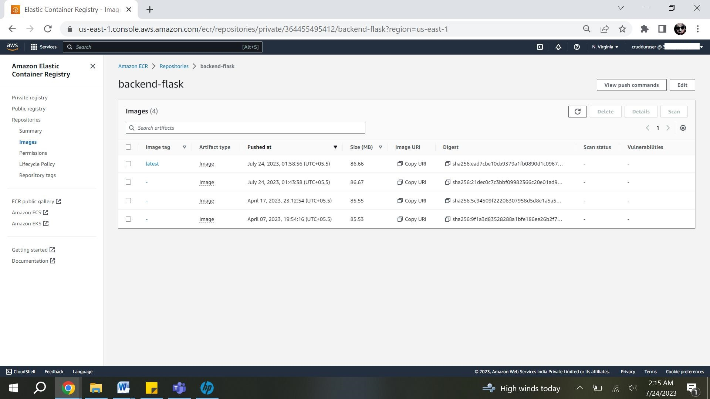
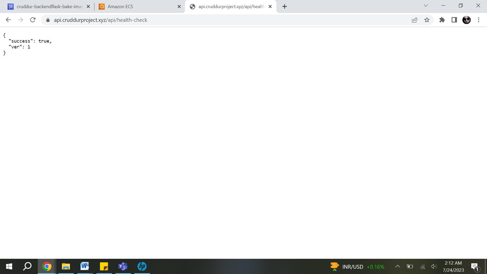

# Week 9 — CI/CD with CodePipeline, CodeBuild and CodeDeploy

CI/CD as name suggest is part of software left cycle, where development and deployment of a code or application goes in parallel or in continuation.

AWS provides fully mananged service to manage your code build deployment testing of software applications.

Code Deploy- CodeDeploy is a deployment service that automates application deployments to Amazon EC2 instances, on-premises instances, serverless Lambda functions, or Amazon ECS services.

CodeBuild -Create a fully automated software release process that promotes code changes through multiple deployment environments. With Codebuild we can compile our code run tests and access run time environments like ECS.

CodePipeline-AWS CodePipeline is a continuous delivery service you can use to model, visualize, and automate the steps required to release your software. You can quickly model and configure the different stages of a software release process . You can add steps for verification prebuild and deployment.

By using above above tools we can create a CI/CD  pipeline which will build test deploy our code. All these services are fully managed by AWS.

## CODEBUILD:

1. Create Build Project:

* Give a project name and description.
* We will be using Github as source provider and branch and repository details for the code we want to build. 
* Event tyoe to be use pull merged request asn Linux2 as operating system.
* We created a new srvice role to provide necessary access for building . We added a inline policy to the service role mentioned below.
* Select "Use a buildspec file" and add the path to the buildspec file.

Create an inline policy for the IAM role "build-crudder-service-role".
```
{
	"Version": "2012-10-17",
	"Statement": [
		{
			"Sid": "ECRRepositoryPermissions",
			"Effect": "Allow",
			"Action": [
				"ecr:BatchCheckLayerAvailability",
				"ecr:GetDownloadUrlForLayer",
				"ecr:GetAuthorizationToken",
				"ecr:GetRepositoryPolicy",
				"ecr:DescribeRepositories",
				"ecr:DescribeImages",
				"ecr:ListImages",
				"ecr:PutImage",
				"ecr:PutImageTagMutability",
				"ecr:UploadLayerPart",
				"ecr:CompleteLayerUpload",
				"ecr:InitiateLayerUpload",
				"ecr:BatchGetImage"
			],
			"Resource": "*"
		}
	]
}
```
## CREATING CODEPIPELINE

1. Choose Pipeline Settings:
 
There are 3 stages we have in our pipeline.
   
   Source Stage:
   We will be addign out gihub repository as source. To do this we have to select github as source provider and use connection tab to connect to repository.
   Select repository which we want to build and branch in our cae 'prod'.

   Add Build Stage:
     * Buld stage we will add a action as build and add AWScodebuld as provider.
     * Creata a new project in AWS Codebuild and add project in this step.
     * In output artificats as imagedefinition . this will be used in deployment step.
   
   Add Deploy Stage:
    * Select Amazon ECS as the Deploy Provider.
    * Add imagedefintion in input artificats.


Create BuildSpec YAML File and placed in  location - /aws-bootcamp-cruddur-2023/backend-flask/buildspec.yml

This file is used by AWScodeBuild to build the code 

```yml
# Buildspec runs in the build stage of your pipeline.
version: 0.2
phases:
  install:
    runtime-versions:
      docker: 20
    commands:
      - echo "cd into $CODEBUILD_SRC_DIR/backend"
      - cd $CODEBUILD_SRC_DIR/backend-flask
      - aws ecr get-login-password --region $AWS_DEFAULT_REGION | docker login --username AWS --password-stdin $IMAGE_URL
  build:
    commands:
      - echo Build started on `date`
      - echo Building the Docker image...          
      - docker build -t backend-flask .
      - "docker tag $REPO_NAME $IMAGE_URL/$REPO_NAME"
  post_build:
    commands:
      - echo Build completed on `date`
      - echo Pushing the Docker image..
      - docker push $IMAGE_URL/$REPO_NAME
      - cd $CODEBUILD_SRC_DIR
      - echo "imagedefinitions.json > [{\"name\":\"$CONTAINER_NAME\",\"imageUri\":\"$IMAGE_URL/$REPO_NAME\"}]" > imagedefinitions.json
      - printf "[{\"name\":\"$CONTAINER_NAME\",\"imageUri\":\"$IMAGE_URL/$REPO_NAME\"}]" > imagedefinitions.json

env:
  variables:
    AWS_ACCOUNT_ID: 364455495412
    AWS_DEFAULT_REGION: us-east-1
    CONTAINER_NAME: backend-flask
    IMAGE_URL: 364455495412.dkr.ecr.us-east-1.amazonaws.com
    REPO_NAME: backend-flask:latest
artifacts:
  files:
    - imagedefinitions.json
```

Create a pulld resuest for prod branch it will triggers the pipeline.

## Proof of execution









Update health check in app.py file and verified the new deployment is working fine.

